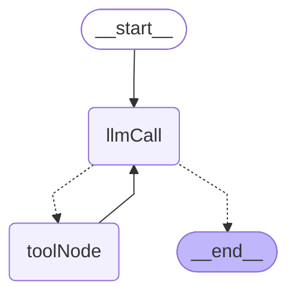

# StateGraph Diagrams

このファイルには、各ファイルで定義されているStateGraphのmermaid図が含まれています。

## 1. src/graph/hello-world.ts - 最もシンプルなグラフ

LangGraphの最も基本的な例です。モックLLMノードが1つだけあるシンプルな構造です。

**主な機能:**
- モックLLMノード（"hello world"を返す）
- 最小限の構成でStateGraphの基本を示す

---

## 2. src/graph/devin-mcp-graph.ts - DeepWiki MCP リポジトリドキュメント分析グラフ

DeepWiki MCPサーバーと連携して、GitHubリポジトリのドキュメントを分析するグラフです。

**主な機能:**
- Wiki構造の取得
- Wikiコンテンツの取得
- インサイト分析
- 質問がある場合のみ回答生成
- AI総合要約の生成

---

## 3. src/graph/graph.ts - シンプルなツール呼び出しエージェント

LLMがツール（add, multiply, divide）を使って算術処理を行うシンプルなエージェントです。

**主な機能:**
- LLMによるツール選択
- ツール実行（add, multiply, divide）
- 結果をLLMにフィードバック

---

## 4. src/graph/graph-trace.ts - Langfuse トレース付きエージェント

graph.tsにLangfuseトレース機能を追加したバージョンです。グラフ構造は同じです。

**主な機能:**
- LLMによるツール選択
- ツール実行（add, multiply, divide）
- Langfuseによる実行トレース

---

## 5. src/graph/complex-graph-auto-trace.ts - 複雑な条件分岐グラフ

入力を分類し、カテゴリに応じて異なる処理パスを選択する複雑なグラフです。

**主な機能:**
- 入力の自動分類（math/text/data/unknown）
- カテゴリ別の専門処理
  - **math**: calculate ツールで数式計算
  - **text**: processText ツールでテキスト操作
  - **data**: analyzeData ツールでデータ統計分析
- 並列エンリッチメント処理（センチメント、複雑度、タグ付け）
- AI要約生成
- Langfuse自動トレース

---

## グラフの特徴まとめ

| ファイル | ノード数 | 条件分岐 | ツール | トレース |
|---------|---------|----------|--------|----------|
| src/graph/hello-world.ts | 1 | 0 | なし | なし |
| src/graph/devin-mcp-graph.ts | 5 | 2 | MCP (DeepWiki) | Langfuse |
| src/graph/graph.ts | 2 | 1 | add, multiply, divide | なし |
| src/graph/graph-trace.ts | 2 | 1 | add, multiply, divide | Langfuse |
| src/graph/complex-graph-auto-trace.ts | 6 | 1 | calculate, processText, analyzeData | Langfuse |
